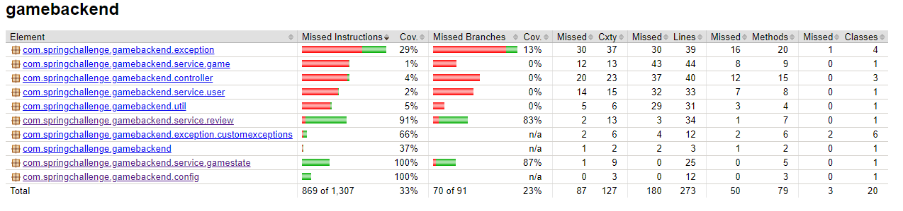

# Community Game Backend
This repository contains our solution to the Java Spring Boot challenge using the concepts covered in the training.

## Challenge details
One of Endava's clients has decided to develop a game review application and you have  been selected as part of the team in charge of developing its backend. This is a community-driven game review web application in which players should be able to search games, write  reviews and indicate which games they are playing, have already beaten, etc.  These are the features with the highest priority, which must be ready for the MVP:

* Sign up a new user
* Log in 
* Log out a user
* Return a game's data
* Return sorted lis of games that match the filters
* Set the state of game for a given user 
* Remove the state of a game for a given user 
* Bulk load games from CSV file 
* Create a review 
* Return list of reviews that match the filters 
* Update a review 
* Delete a review

## Problem analysis 
For the development of the challenge, we first considered which database was best for this type of business. After analyzing what the client required, we decided to use MySQL as the relational database. 

With the database selected, the next step was to create the data model. How the entities were going to be structured and what relationships were going to exist between them. Once we had the data model defined, we created the database and created the corresponding entities both in the database and in Java.

With the entities ready, we divided the work for the development of the requested services. For each major concept (Game, Review and User) we created a rest controller to handle the requests sent to those endpoints. The services and repositories are not only for the big concepts mentioned above, there is also a service to manage the game states (GameStateService) and a repository for each entity (Fame, GameState, Review, State, User), this in order to maintain the principle of single responsibility in each repository.
## Tools (and libraries)
### Development
**IntelliJ and VSCode:** As IDE for code development.

**Maven** As a tool for project management and construction.

**WorkBench:** As a visual tool for database creation and management.

**Postman and Insomnia:** As tools to perform HTTP request and test the developed endpoints.

**Lombok:** As a library for injecting code such as getters, setters or constructors.

**Apache Commons CSV:** As a library for reading CSV files.

**Swagger:** As a framework for generating API documentation

**JUni:** As a framework for writing and running tests.

**Mockito:** As a framework for the creation of simulated objects for the execution of the tests.

### Code quality
**SonarLint:** As an extension to identify and solve code quality and security problems.

## Unit test

Unit test coverage



## Getting started 
### Prerequisites 
-   [Git](https://git-scm.com/downloads) - Version control system
-   [Maven](https://maven.apache.org/download.cgi) - Project management and construction
-   [Java 11](https://www.java.com/download/ie_manual.jsp) - Development environment
-   [MySQL](https://dev.mysql.com/downloads/installer/) - Database management 
  - [WorkBench](https://dev.mysql.com/downloads/workbench/) - (Visual tool for database management Optional)
-   [Intellij Idea](https://www.jetbrains.com/es-es/idea/download/) (IDE Optional)

## Installing 
* Clone this git repository into your computer 
```
git clone https://github.com/SpringBootChallenge/CommunityGameBackend.git
```
* For create database, you have to run a script into MySQl command line
```
mysql > source /resources/databaseScript/databaseCreation.sql
```
* To run the project, you must go to the CommunityGameBackend folder and execute the following commands: 
  * To delete the dependencies and modules that may exist
  ```
    mvn clean 
  ```
  * To compile and package the project 
  ```
    mvn package -U 
  ```
  * To compile and package the project
  ```
    mvn package -U 
  ```
  * To execute the project
  ```
    mvn spring-boot:run
  ```

* If you want to run the tests
  ```
    mvn test
  ```

* Once the project is running, you can test the endpoints by going to [SwaggerApiDocumentation](http://localhost:8080/swagger-ui.html), there you will find the way to make the requests and the possible expected responses.


/v2/api-docs
## Authors
* **Laura Valentina García** - [Github](https://github.com/laura-gar) 
* **Juan David Valencia** - [Github](https://github.com/juanvalag2019)